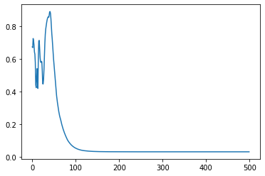
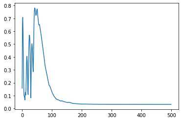
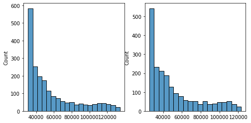
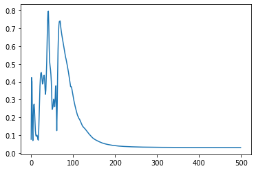
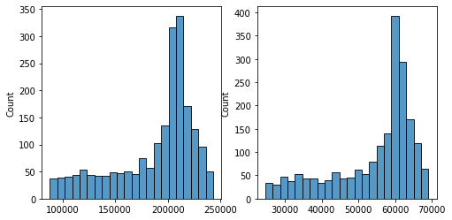
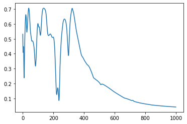
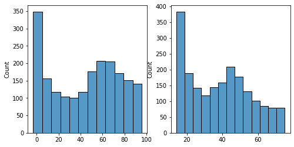
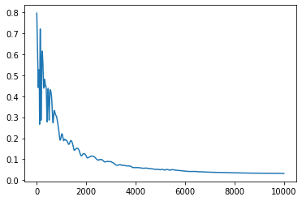
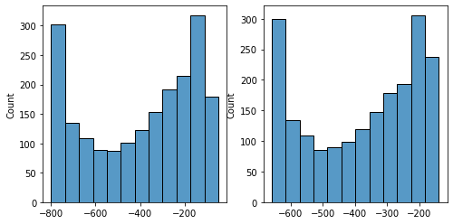

# Problems

当 learning rate 较大时($> 10^{-4}$)观察到以下几个现象：

1. 开始时loss下降，但是训练到一定程度时继续训练loss不减反增
2. 一段时间后loss再次下降且下降较为缓慢，训练足够多的epoch后loss完全不变
3. gamma越小loss前期的波动越多，但足够多的epoch后loss还是会完全不变

以下几组参数为例（batch_size 均为 256）：

$lr = 10^{-2}$， gamma = 100:

$lr = 10^{-2}$， gamma = 10: （gamma较小时波动显著增大）

$lr = 10^{-2}$， gamma = 1:

$lr = 10^{-3}$， gamma = 100: （learning rate 下降训练足够多的epoch仍然会向上面一样梯度消失）

$lr = 10^{-4}$， gamma = 100: （取较小梯度训练10000个epoch，梯度仍然消失）

**成因分析：**

用训练后的网络处理训练数据X，得到结果Y。计算X与Y之间的mmd距离，公式如下：
$$
\sqrt{k(X,X).mean() - 2k(X,Y).mean() + k(Y, Y).mean()}
$$
$k(X, X)$ 是个不变的矩阵，可以不用考虑

$k(X, Y)$ 最后得出的结果是一个全为0的矩阵，说明 X 与 Y之间并没有任何相近的数据点

$k(Y, Y)$ 最后得出的结果是一个单位矩阵，说明Y的各个点之间距离都很大。这一点也可以从结果上看出来，Y的每一个点数值都非常大因而导致rbf kernel除了对角线外都是 0

当做优化时，降低loss的方法除了最大化 $k(X, Y).mean()$ 之外还有 最小化 $k(Y, Y).mean()$， 优化器将 $k(Y, Y)$ 里面所有的点数值变得很大，使得 $k(Y, Y)$矩阵中除了对角线之外的值都为0，此时loss就不再降低了，优化器停止优化

**后续工作思路：**

1. loss加惩罚项，限制生成数据的大小
2. 尝试其它kernel
3. 尝试更小的learning rate，试试在训练初期loss波动的最低取值处选取停止训练，观测结果

## 1. Different Activations

## 1.1 Tanh

$lr = 10^{-2}$，gamma=100

$lr = 10^{-3}$，gamma=100
